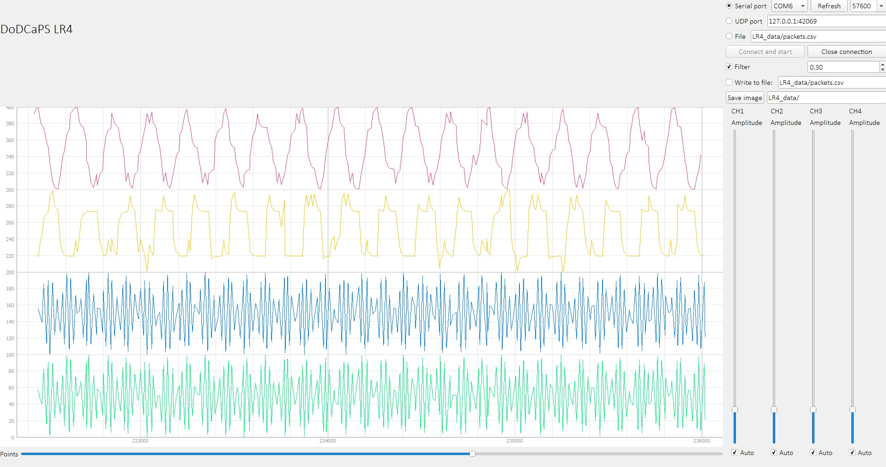

# Разработка систем сбора и обработки данных. Лабораторно-практическое задание № 4
## Python. Полностью свободное использование



### Задание:

```
Лабораторно-практическое задание № 4
Тема: Разработать многоканальную систему накопления и отображения данных
измерений.
Цель работы: Разработать систему накопления и визуализации данных в виде графиков
Задачи:
 Подготовить приложение получающее данные с серийного порта и по UDP, по 4
независимым каналам;
 Разработать функцию сохранения данных в файле с временными отметками и
настраиваемой фильтрацией (по времени, по реакции на событие – выход за
диапазон или быстрое изменение);
 Разработать функцию визуализации данных по заданным параметрам (диапазон
времени, масштаб, частота выборки) по накопленным данным;
 Разработать функцию отображения текущих данных с заданными настройками
визуализации (масштаб по времени, масштаб по амплитуде);
 Разработать функцию фильтрации шумов с использованием статистических
методов (выборочное среднее, скользящее среднее (два варианта), медианную
фильтрацию и т.п.);
 Реализовать возможность сохранения изображения графиков.
Порядок выполнения работы
Задача 1
Подготовить приложение для получения данных из разных источников.
Задача 2
Реализовать функцию сохранения данных в файле с параллельным доступом или в
базе данных Access.
Задача 3
Реализовать функцию выборки и отображения данных.
Задача 4
Реализовать функции мультиканального осциллографа с ручной настройкой
параметров отображения данных
Задача 5
Реализовать функции статистической обработки данных (текущих и накопленных)
Задача 6
Реализовать сохранения «скриншота» отображаемого графика с генерацией нового
имени при каждом сохранении.
```
